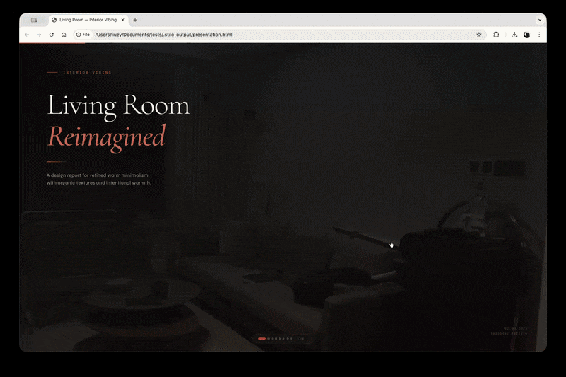

# Interior Vibing

Claude code skill. Upload a room photo. Get a redesign rendering and a polished presentation deck — room analysis, before/after, shopping list, ROI estimates. Every recommendation is specific to your room's architecture, your goal, and real purchasable items with prices.

<p align="center">
  
</p>

## How It Works

1. Upload a room photo
2. Say what you need — Airbnb staging, rental appeal, home sale, personal refresh
3. The skill analyzes your space (dimensions, materials, light, fixed elements)
4. Gemini generates a photorealistic redesign rendering
5. You get an 8-slide click-through deck: before/after, analysis, shopping list, budget tiers

## Install

### Claude Code

```bash
# Clone into your skills directory
git clone https://github.com/aarontuo/interior-vibing.git ~/.claude/skills/interior-vibing

# Or clone into a project
git clone https://github.com/aarontuo/interior-vibing.git
cp -r interior-vibing my-project/.claude/skills/interior-vibing

# Or use agent-skills-cli (works with Cursor, VS Code, etc.)
npx agent-skills-cli add aarontuo/interior-vibing
```

### Claude.ai (Projects)

1. Open a Project → Project Knowledge
2. Upload `SKILL.md` and `scripts/render.py`
3. Upload a room photo and start designing

### Any LLM

`SKILL.md` is model-agnostic. Paste it into system instructions for any LLM that supports code execution. `render.py` calls Gemini's API regardless of which LLM orchestrates the workflow.

## Setup

### 1. Get a Gemini API Key

Free tier available at [aistudio.google.com/apikey](https://aistudio.google.com/apikey).

### 2. Set Your Key

```bash
cp .env.example .env
# Edit .env and add your key
```

Or set it directly:

```bash
export GEMINI_API_KEY=your_key_here
```

### 3. Install Dependencies

```bash
pip install google-genai Pillow
```

## What's in the Deck

| Slide | Content |
|-------|---------|
| 1. Title | Room photo background, room type + purpose |
| 2. Before | Original photo, room type, size, condition |
| 3. Analysis | Dimensions, light, materials, best asset, biggest problem |
| 4. Concept | Style direction, 5-color palette, design narrative |
| 5. After | Gemini-generated redesign rendering |
| 6. Comparison | Before/after side by side with numbered annotations |
| 7. Shopping list | Items ranked by impact with 3-tier pricing |
| 8. Investment | Budget/recommended/premium tiers, payback periods |

## Models

| Task | Model |
|------|-------|
| Room analysis | `gemini-2.5-flash` |
| Image generation | `gemini-3-pro-image-preview` |

## Standalone Usage

```bash
# Analyze a room
python scripts/render.py analyze --image room.jpg

# Generate a redesign
python scripts/render.py render \
  --image room.jpg \
  --prompt "King bed with white linen bedding, oak nightstands..." \
  --purpose "airbnb listing" \
  --style "warm scandinavian" \
  --resolution 2K \
  --aspect-ratio 4:3

# Edit specific areas
python scripts/render.py edit \
  --image room.jpg \
  --prompt "Replace the brass fixture with a matte black pendant." \
  --resolution 2K
```

Outputs go to `.stilo-output/` in your working directory.

## File Structure

```
interior-vibing/
├── SKILL.md           ← Instructions for Claude
├── scripts/
│   └── render.py      ← Gemini API bridge
├── assets/
│   └── demo.gif       ← Demo walkthrough
├── .env.example       ← API key template
└── README.md
```

## License

MIT
